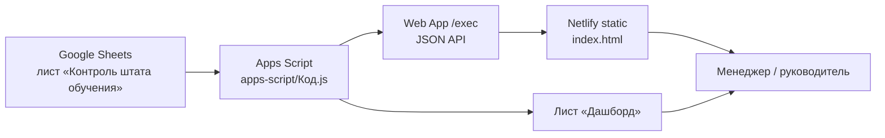

# Архитектура

## Назначение

Операционный дашборд обучения: сводка по группам тренеров (воронка, отсев, конверсии) без выгрузки сырых ПДн учеников во внешний UI.

## Контекст системы



## Компоненты

### 1. Источник данных (Sheets)

- Лист `Контроль штата обучения` — построчные группы.
- Схема колонок A–R зафиксирована в [DataModel.md](DataModel.md).
- Комментарии строк: «не собралась» вне расчёта; «распалась» в valid с меткой; законченность по D ≤ сегодня (см. DataModel / ADR-014).

### 2. Apps Script (backend)

Один файл `apps-script/Код.js`, три роли:

| Функция | Роль |
|---------|------|
| `collectDashboardData()` | Единая агрегация (SoT для цифр) |
| `buildDashboard()` | Материализация в лист «Дашборд» + чарты |
| `doGet()` | Публикация агрегатов как JSON |

Меню `onOpen` → «Дашборд обучения» → обновление листа.

Конфиг вверху файла: имена листов, диапазон строк, последняя колонка.

### 3. JSON API

- Тип: Web App, `executeAs: USER_DEPLOYING`, `access: ANYONE_ANONYMOUS`.
- Ответ: один JSON-объект (см. [ApiContract.md](ApiContract.md)).
- Нет auth, нет пагинации, нет мутаций (только GET).

### 4. Frontend

- Один файл `index.html` (разметка + CSS + JS).
- Chart.js с CDN.
- Загрузка: `fetch(url, { cache: 'no-store' })`.
- Автообновление: раз в сутки в 08:00 МСК (05:00 UTC).
- Вкладки: Обзор / По тренерам / По месяцам + detail overlay.

### 5. Доставка

```
Cursor → git push origin main → GitHub → Netlify build/publish
Cursor → clasp push [/ deploy] → Apps Script runtime
```

Два независимых пайплайна. Синхронизация нужна только при смене контракта.

## Принципы (чтобы не копить долг)

1. **Single aggregation path** — все цифры из `collectDashboardData()`. UI не пересчитывает бизнес-метрики иначе, чем показывает уже посчитанное (допустимы только presentation-aggregates из `groups[]`, согласованные с контрактом; фильтр месяца повторяет правило `completed`).
2. **Contract-first** — JSON описывается в ApiContract до/вместе с кодом.
3. **No PII in API** — в JSON только агрегаты и метки групп/тренеров; имена учеников не отдаём.
4. **Stable deployment URL** — обновляем существующий deployment, не плодим новые `/exec` без нужды.
5. **Docs as code** — ADR + контракт живут в репозитории.

## Текущие ограничения

| Ограничение | Следствие |
|-------------|-----------|
| Монолит `index.html` | Сложность растёт линейно; вынос модулей — в Roadmap |
| Монолит `Код.js` | То же для GAS |
| Публичный `/exec` | Любой с URL видит агрегаты (см. Security) |
| Диапазон A1:R500 | Строки >500 не попадут в расчёт |
| Нет тестов | Регрессии ловим вручную / визуально |

## Целевая эволюция (не сейчас)

При росте сложности — разделить frontend на модули, GAS на `Code.js` + `Data.js` + `Api.js`, зафиксировать через ADR. Не делать «на всякий случай» раньше боли.
